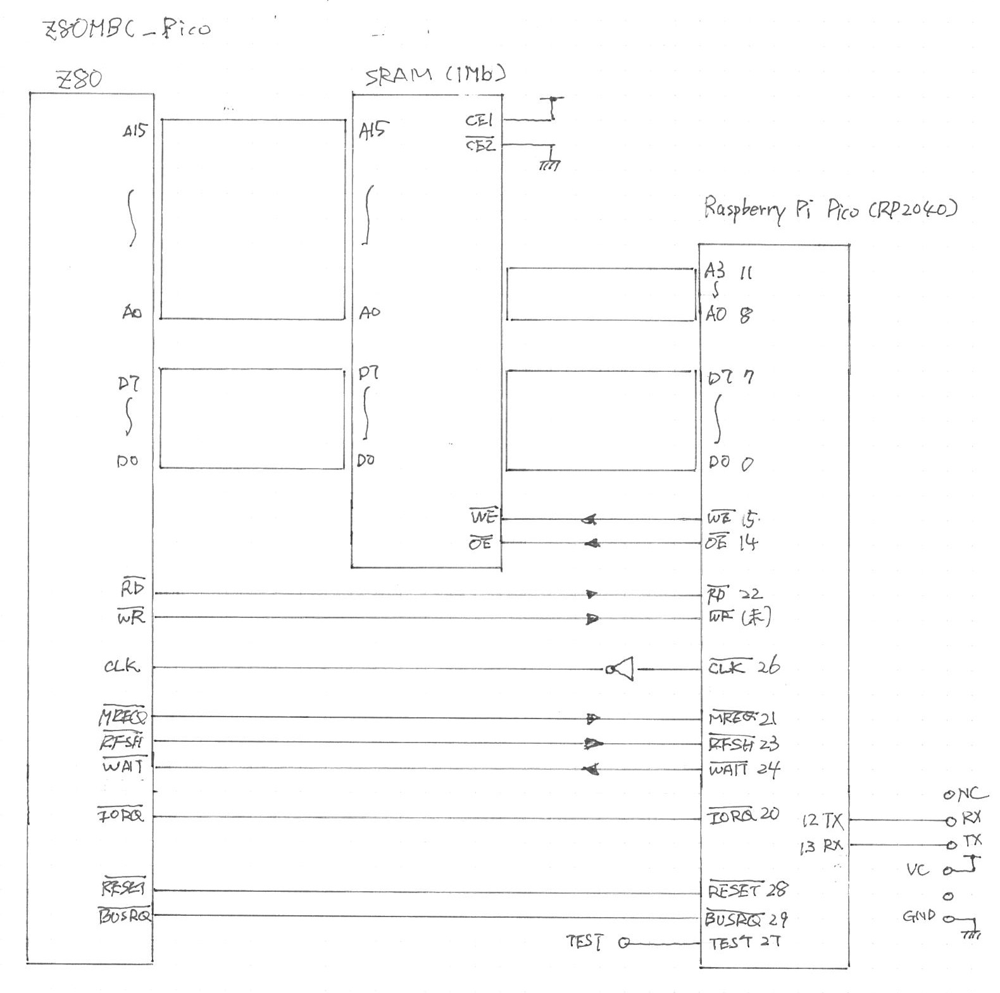

# z80mbc_pico

PICO version of Z80MBC.  Main focus are WAIT cycle generator on Pico instead of Pico2, Bootloading

Raspberry Pi Pico, SRAM, Z80 の3チップ構成で Z80 を動かす。かの名機 [`Z80-MBC`](https://github.com/SuperFabius/Z80-MBC) (MBC2 でないほう) の発想を生かし、I/O 空間に 4本分 16アドレスを割り当てている。

が、本プロジェクトの目的が、Aki80 12MHz 駆動の際の ROM エミュレーションのためのブートローダ機能の動作確認にあるので、Z80-MBC のI/O 機能すべて動作させるかどうかは確かではない(たぶんやらない)。

## 構成

PICO は、Z80クロック生成、SRAMへの Z80 プログラム展開(ブートローダ)、Z80 の I/O デバイス(UART, LED blink) を動かす。ブートローダ機能だけなら I/O デバイス機能は不要だが、Z80 12MHz 動作の事前確認も行いたいので、UART デバイスだけは動作させるつもりだ。

SRAM 駆動は、/OE, /WE を Z80 直結とせず、Pico を介して駆動するようにする。ブートローダ実行時は、/OE, /WE は Z80 の /RD, /WR 信号と切り離され、Pico のブートローダ機能により駆動される。

ブートローダは、Z80 のアドレスバス出力を使い SRAM 希望のアドレスにアクセスする。Z80 にリセット解放後、WAIT 状態に入る。Z80 は M1 サイクルで最初の命令をフェッチしようとアドレス 0000 をアドレスバスに書き出している。この状態でデータバスに書き込みたいデータを置き、 /WE をプルプルすることで SRAM にデータを書き込む。書き込み後にデータバスに 00(NOP命令) を出力し、WAIT を開放して CPU に NOP 命令を実行させると、Z80 は PC をインクリメントして、次の命令をフェッチしようとアドレスバスに 0001 を出力する。このように、アドレスデータは CPU に生成させることで、Pico 自身はアドレスバス監視・出力を不要としてピンを節約できる。

> CPU にアドレスを生成させ、/WE を操作して SRAM に書き込むやり方のアイディアは、[@DragonBallEZ - Z80でCP/MとかFUZIXとか](https://x.com/DragonBallEZ) さんに頂きました。感謝。

ブートローダ機能としてはアドレスバスアクセスは不要であるが、
Z80 の I/O デバイスとして動作するために、I/O アドレスを得るためにアドレスバスに接続が必要である。ここでは、Z80-MBC にならい、A0-A3 の4本を接続している。

> Z80-MBC2 は、更に徹底して、ATmega32 に A0 の1本だけを接続して、I/O ポートとして 2アドレスだけを使用している。

例によってメモは [doc/LOG.md](doc/LOG.md) に置いてある。

